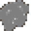
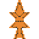
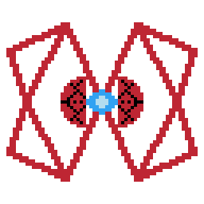

# Overview

This is Notsconian. Its a game I made in Godot engine modeled after the the arcade classic, Bosconian. Upon starting, you the player take control of a starship to fight the evil aliens (story in progress)!! The ship flies forward automatically. You control the ship's direction with WASD. Press either 4 on the number pad or 'j' if you don't have one to fire a purple laser both forward and backwards simultaniously. Watch out, space is dangerous. There are astroids, alien craft, and space stations out there that will spell your demise if you are hit by them. Destroy the space stations, HEX BASES, to progress to the next level. Raise your score by destroying enemies. Bonus points are granted for destroying all six orbs on a Hex Base. There are three levels currently implemented. Destroy the bases by either destroying the six orbs surrounding them, or getting a narrow shot down the center to hit their core. Upon completing a level, you current total score will display the next level starts automatically. Don't take too long however, after a while the stage will enter code red and you'll be swarmed by eneimes! Dying once loses you a life. Lose all your lives, and you'll be sent back to the title screen to start over.

### On Android
Slide your finger over the arrow pad to control the ship and tap the target-looking button on the right to fire.

### Enemy and Obstacles
 Asteroid, 15pts --- Simple space rocks. Lead enemies into them to destroy them both (you won't get any points that way however).

 Arcship, 80pts --- Faster than you and pretty agile. Requires some maneuvaring to escape.

 Bugship, 50pts --- Slow but the most agile of the enemies.

 Bulletship 100pts --- Rocket fast but the least agile of the three. Just move out of the way!

 Hex Orb, 30 pts --- Six serve as weapons on each Hex Base. Destroying one disables its cannon fire. Destoy them all and the whole base explodes!

 Hex Base, 1000-1320pts --- Your primary objective is to destroy these. Get close and they'll begin firing at you. Hit the core or all the orbs to destoy it!

 COMING SOON --- Who is this flying away? Can't be important may as well ignor-...

The game has its core features but is not yet feature complete.

I wanted to learn a game engine and make a little bigger project than I usually do. Godot had a lot of promise as an open source engine. I had a great time developing with it. Porting it to Android made sense as it has simple controls that aren't too bad on a touch screen. The touch screen buttons I implemented only appear on mobile.

* [Most Recent Code Demo](https://youtu.be/tONsQPiphzw)

* [Most Recent Gamplay Demo](https://youtu.be/ZTYpnCY9vrM)

# Development Environment

## Software
This project was made in Godot engine. I did all the scripting with GDscript, Godot's own scripting language with python style syntax. 

Compiling and exporting to Android done with OpenJDK and the Android SDK downloaded from Android Studio.

Everything else is done in Godot's editor, a powerful tool with which to structure your game.

##  Art 
All in game art and sound was created by myself as well. I used Libresprite, a free and open source distro of Asesprite for all the visuals and sprites.  I used Anvil Studio and Audacity to create the sound.

# Useful Websites

* [Godot Docs](https://docs.godotengine.org/en/stable/index.html)
* [Godot Docs Vecotor Math intro](https://docs.godotengine.org/en/stable/tutorials/math/vector_math.html)
* [Export to Android(Android Studio Docs)](https://docs.godotengine.org/en/stable/tutorials/export/exporting_for_android.html)
* [Export to Android(Godot docs)](https://developer.android.com/games/engines/godot/godot-export)

# Future Work

* Border crossing laser glitch
* ~~Implement Hex Base projectiles~~
* ~~Implement auto spawning for enemies~~
* Implement enemy formations
* Make more and better stage designs
* ~~Implement changing alert conditions~~
* Add low quality voice lines
* Add HUD for radar (minimap) (some HUD added already)
* Add more unique explosion animations ~~and sounds. More sound effects in general as features increase.~~
* ~~Add points system~~
* Implement top high score board that saves
* Implement Hex Base features such as core protection
* Bonus lives for reaching various score thresholds

